# Trabajo Práctico 1 - Introducción a Git

## 1. Instalar Git
Los pasos y referencias asumen el uso del sistema operativo Windows, en caso otros SO seguir recomendaciones específicas.

- Bajar e instalar el cliente git. Por ejemplo, [Git for Windows](https://git-for-windows.github.io/).  
- Bajar e instalar un cliente visual. Por ejemplo, TortoiseGit para Windows o SourceTree para Windows/MAC:  
  - [TortoiseGit](https://tortoisegit.org/)  
  - [SourceTree](https://www.sourcetreeapp.com/)  
  - Lista completa: [Git GUIs](https://git-scm.com/downloads/guis)  

## 2. Crear un repositorio local y agregar archivos
1. Crear un repositorio local en un nuevo directorio:  
    ```sh
    mkdir repo-local
    cd repo-local
    git init
    ```

2. Agregar un archivo Readme.md, agregar algunas líneas con texto a dicho archivo:  
    ```sh
    echo "Algunas lineas de texto" > readme.md
    git add readme.md
    git commit -m "Agregar archivo readme"
    ```

3. Crear un commit y proveer un mensaje descriptivo:  
    ```sh
    echo "Algunas lineas de texto" > readme.md
    git add .
    git commit -m "Initial commit"
    ```

## 3. Configuración del Editor Predeterminado
Instalar Notepad++ para Windows o TextMate para Mac OS, colocarle un alias y configurarlo como editor predeterminado:  
- Para Notepad++:  
    ```sh
    git config --global core.editor "'C:/Program Files (x86)/Notepad++/notepad++.exe' -multiInst -nosession"
    ```
- Para TextMate:  
    ```sh
    git config --global core.editor "mate -w"
    ```

## 4. Creación de Repos 01 -> Crearlo en GitHub, clonarlo localmente y subir cambios
1. Crear una cuenta en [GitHub](https://github.com).  
2. Crear un nuevo repositorio en dicha página con el Readme.md por defecto:  
   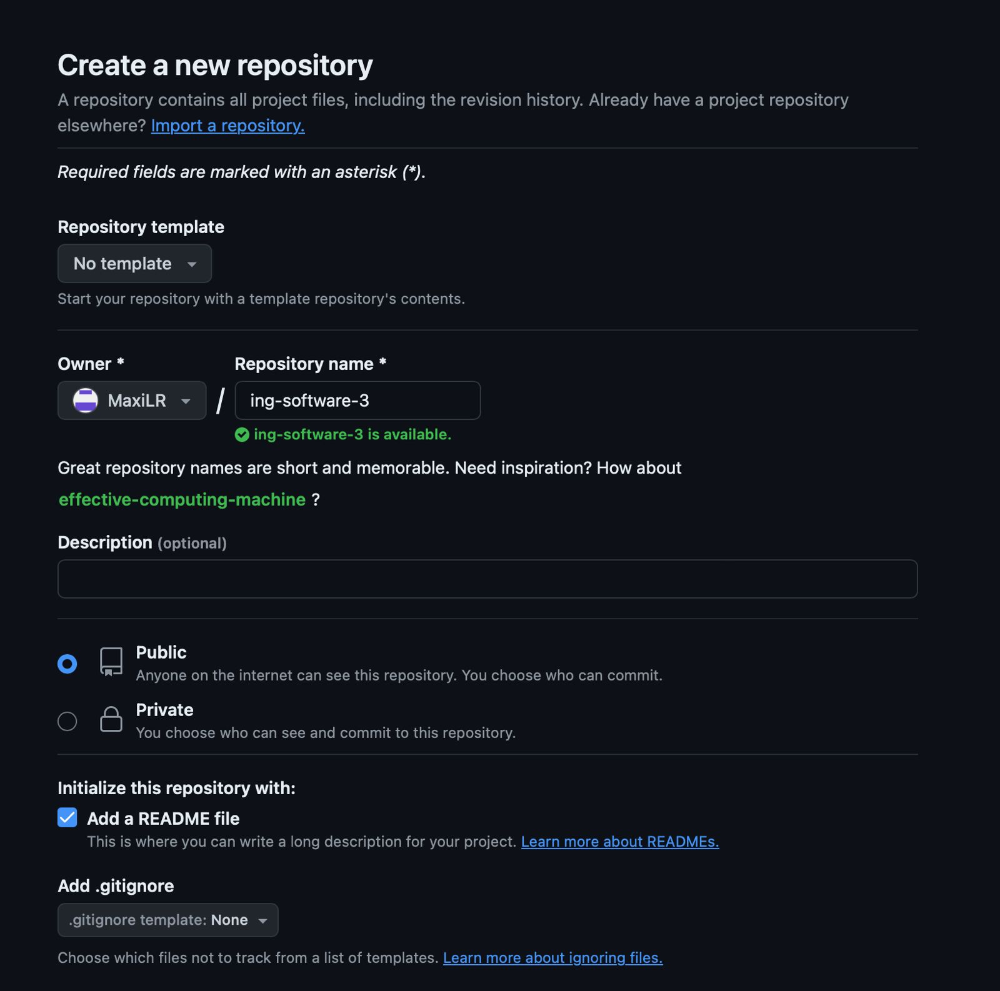

3. Clonar el repo remoto en un nuevo directorio local:  
    ```sh
    git clone https://github.com/MaxiLR/ing-software-3
    ```
   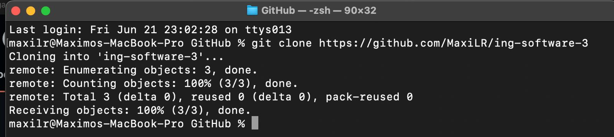

4. Editar archivo Readme.md agregando algunas lineas de texto:  
   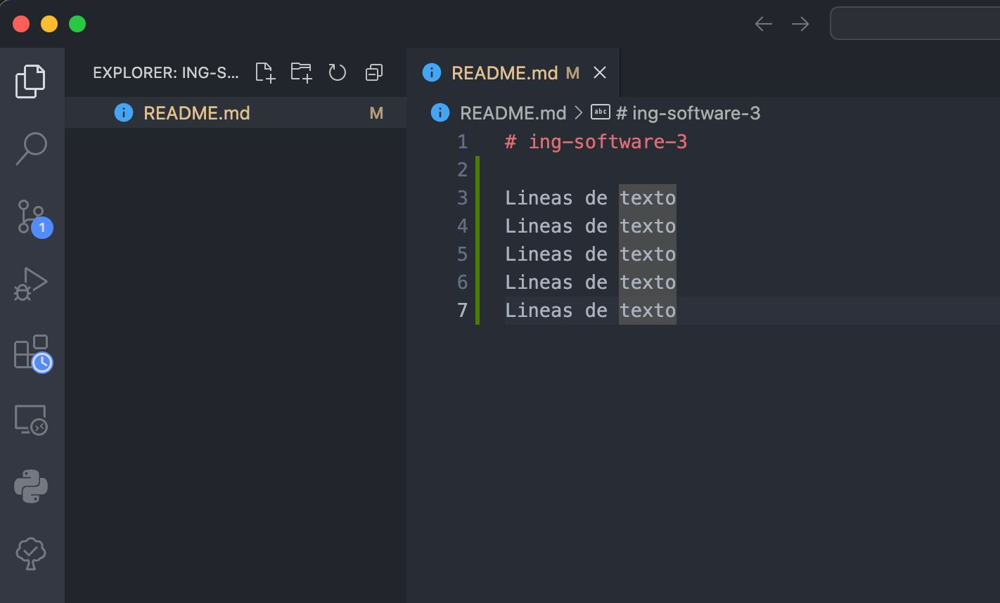

5. Editar (o crear si no existe) el archivo `.gitignore` agregando los archivos `*.bak`:  
   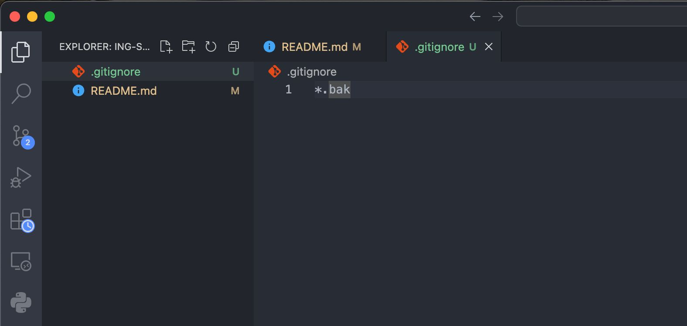

6. Crear un commit y proveer un mensaje descriptivo:  
    ```sh
    git add .
    git commit -m "Initial commit"
    ```
   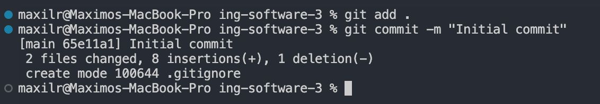

7. Intentar un push al repo remoto:  
    ```sh
    git push
    ```
   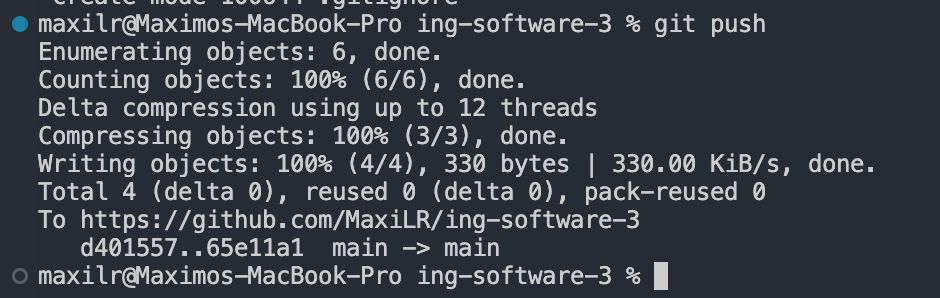

   En caso de ser necesario configurar las claves SSH requeridas y reintentar el push.

## 5. Creación de Repos 02-> Crearlo localmente y subirlo a GitHub
1. Crear un repo local:  
    ```sh
    mkdir repo-local
    cd repo-local
    git init
    ```
   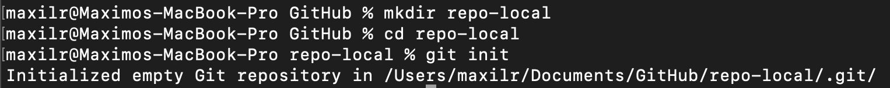

2. Agregar archivo Readme.md con algunas lineas de texto:  
    ```sh
    echo "Algunas lineas de texto" > readme.md
    git add readme.md
    git commit -m "Agregar archivo readme"
    ```
   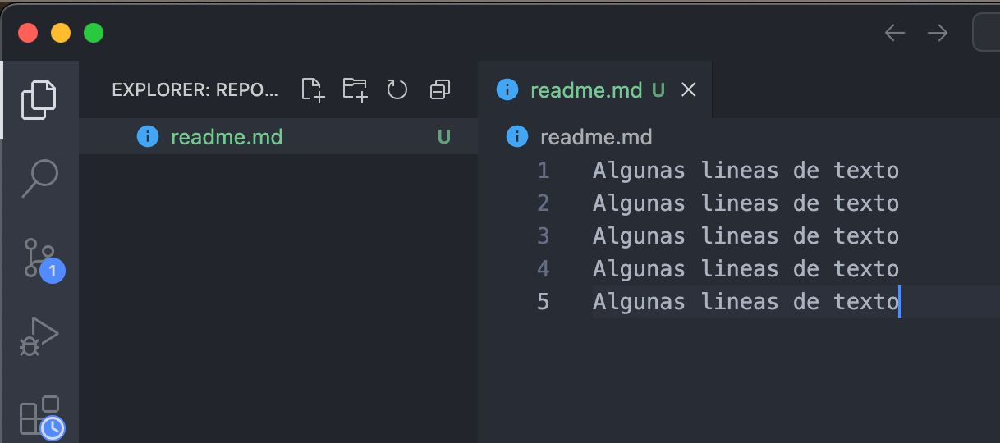
     
   

3. Crear repo remoto en GitHub:  

    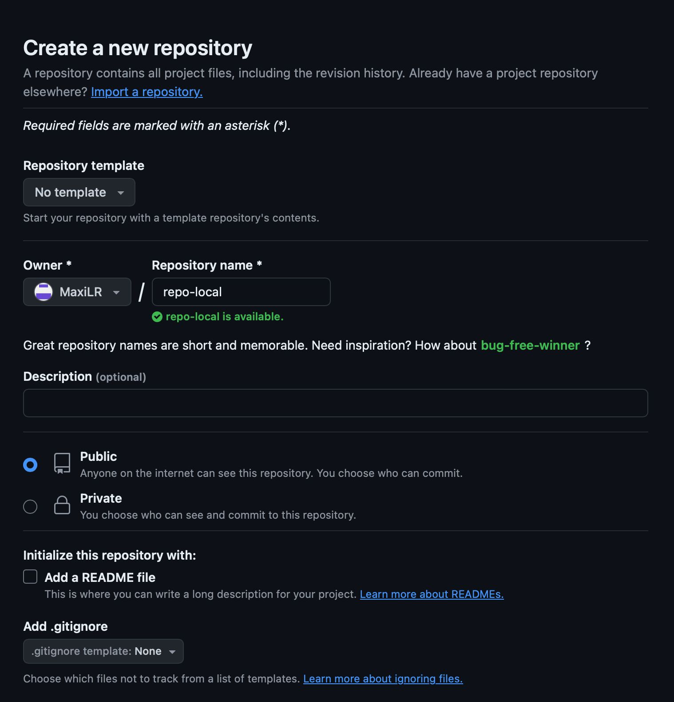

4. Asociar repo local con remoto:  
    ```sh
    git remote add origin https://github.com/MaxiLR/repo-local.git
    git push -u origin main
    ```
   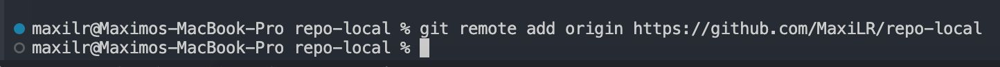

5. Crear archivo `.gitignore` y agregar los archivos `*.bak`:  
    ```sh
    echo "*.bak" > .gitignore
    git add .gitignore
    git commit -m "Agregar archivo .gitignore"
    ```
    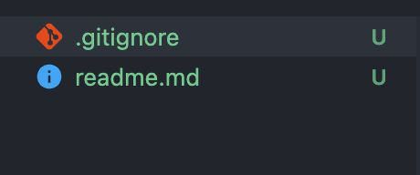

6. Crear un commit y proveer un mensaje descriptivo:  
    ```sh
    git add .
    git commit -m "Agregar archivo readme y .gitignore"
    git push
    ```
   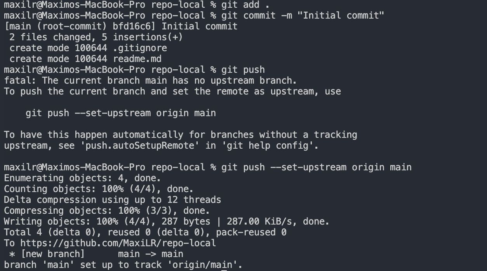

## 6. Ramas
1. Crear una nueva rama:  
    ```sh
    git checkout -b dev
    ```
   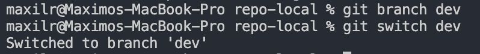

2. Cambiarse a esa rama:  
    ```sh
    git checkout dev
    ```
   

3. Hacer un cambio en el archivo Readme.md y hacer commit:  
    ```sh
    echo "Cambio en nueva rama" >> readme.md
    git add readme.md
    git commit -m "Cambio en nueva rama"
    ```
   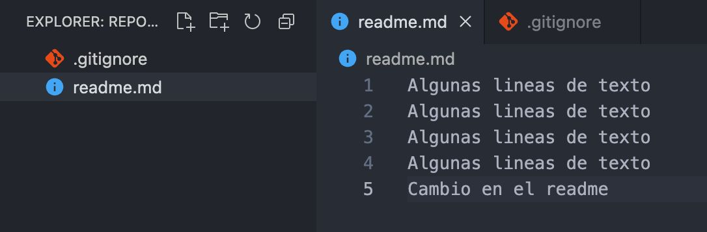
     
   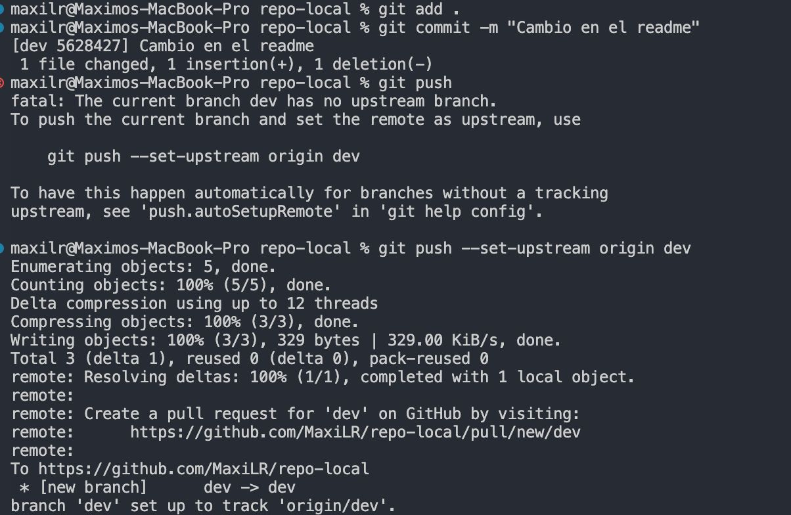

4. Revisar la diferencia entre ramas:  
    ```sh
    git diff main dev
    ```
   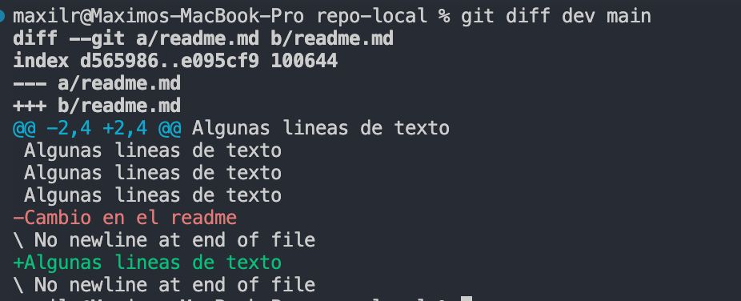

## 7. Merges
1. Hacer un merge FF:  
    ```sh
    git checkout main
    git merge dev
    ```
   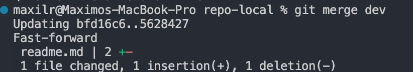

2. Borrar la rama creada:  
    ```sh
    git branch -d dev
    ```

3. Ver el log de commits:  
    ```sh
    git log
    ```
   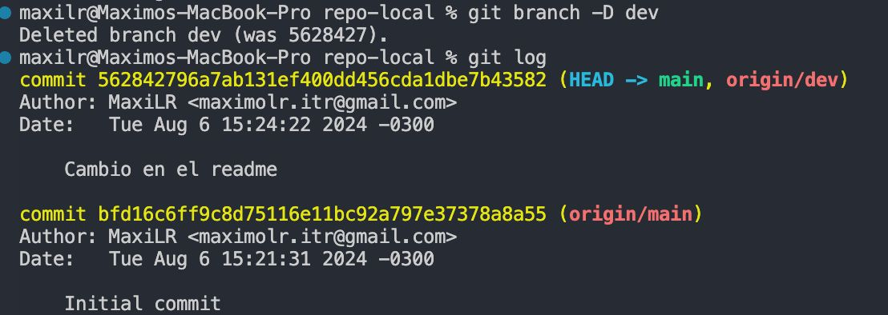

4. Repetir el ejercicio 6 para poder hacer un merge con No-FF:  
    ```sh
    git checkout -b otra-rama
    echo "Otro cambio" >> readme.md
    git add readme.md
    git commit -m "Otro cambio en otra-rama"
    git checkout main
    git merge --no-ff otra-rama
    ```

## 8. Resolución de Conflictos

1. Instalar alguna herramienta de comparación. Idealmente una 3-Way:
   - P4Merge: [Helix Visual Client (P4V)](https://www.perforce.com/downloads/helix-visual-client-p4v)
     - Se puede omitir la registración. Instalar solo la opción Merge and DiffTool.
   - BeyondCompare trial version: [Scooter Software](https://www.scootersoftware.com/download.php)

2. Configurar TortoiseGit/SourceTree para soportar esta herramienta:
   - [Configurar P4Merge con TortoiseGit](https://medium.com/@robinvanderknaap/using-p4merge-with-tortoisegit-87c1714eb5e2)
   - [Configurar BeyondCompare con VCS](https://www.scootersoftware.com/support.php?zz=kb_vcs)

3. Crear una nueva rama `conflictBranch`:
    ```sh
    git checkout -b conflictBranch
    ```

4. Realizar una modificación en la línea 1 del `Readme.md` desde `main` y commitear:
    ```sh
    git checkout main
    echo "Cambio en la rama main" > readme.md
    git add readme.md
    git commit -m "Cambio en la rama main"
    ```

5. En la `conflictBranch` modificar la misma línea del `Readme.md` y commitear:
    ```sh
    git checkout conflictBranch
    echo "Cambio en conflictBranch" > readme.md
    git add readme.md
    git commit -m "Cambio en conflictBranch"
    ```

6. Ver las diferencias con:
    ```sh
    git difftool main conflictBranch
    ```

7. Cambiarse a la rama `main` e intentar mergear con la rama `conflictBranch`:
    ```sh
    git checkout main
    git merge conflictBranch
    ```

8. Resolver el conflicto con:
    ```sh
    git mergetool
    ```

9. Agregar `.orig` al `.gitignore`:
    ```sh
    echo "*.orig" >> .gitignore
    git add .gitignore
    git commit -m "Agregar .orig al .gitignore"
    ```

10. Hacer commit y push:
    ```sh
    git add readme.md
    git commit -m "Resolver conflicto y hacer merge"
    git push
    ```

## 9. Familiarizarse con el concepto de Pull Request
1. Explicar qué es un pull request:  
*Un Pull Request (PR) es una solicitud para que los cambios propuestos en una rama de un repositorio de control de versiones sean revisados y, si se aprueban, fusionados (merge) con otra rama. Los Pull Requests son una característica clave de las plataformas de gestión de código fuente como GitHub, GitLab y Bitbucket, y son fundamentales para la colaboración en proyectos de software.*

2. Crear un branch local y agregar cambios a dicho branch:  
    ```sh
    git checkout -b pull-request-branch
    echo "Cambios para PR" >> readme.md
    git add readme.md
    git commit -m "Cambios para pull request"
    ```
   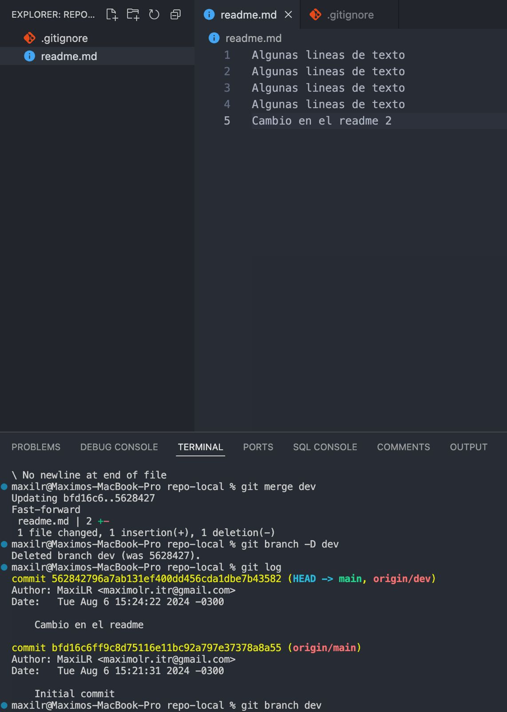
     
   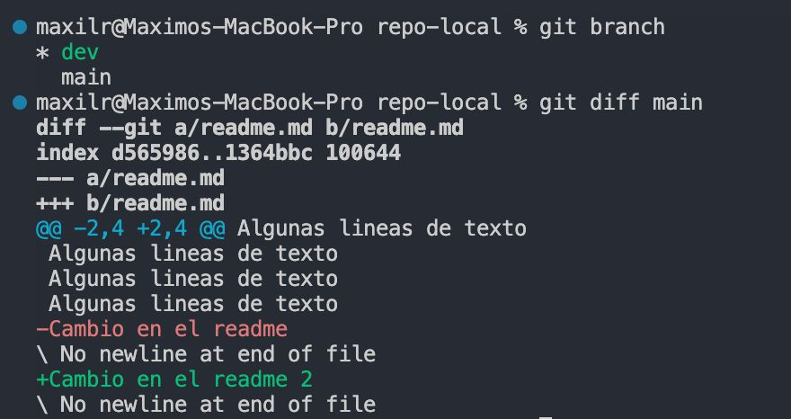

3. Subir el cambio a dicho branch y crear un pull request:  
    ```sh
    git push origin pull-request-branch
    ```
    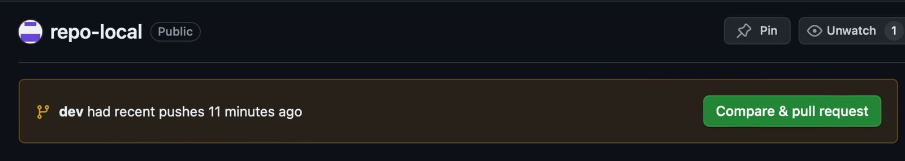
   

4. Crear un pull request en GitHub:  
   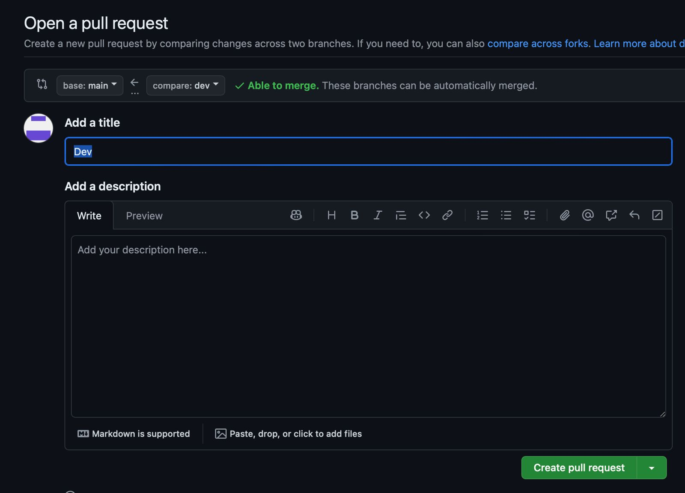

5. Completar el proceso de revisión en GitHub y mergear el PR al branch master:  
   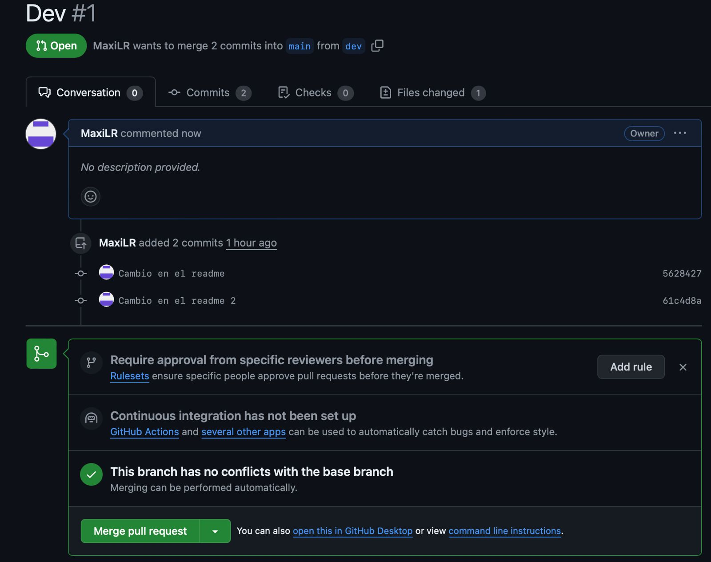
     
   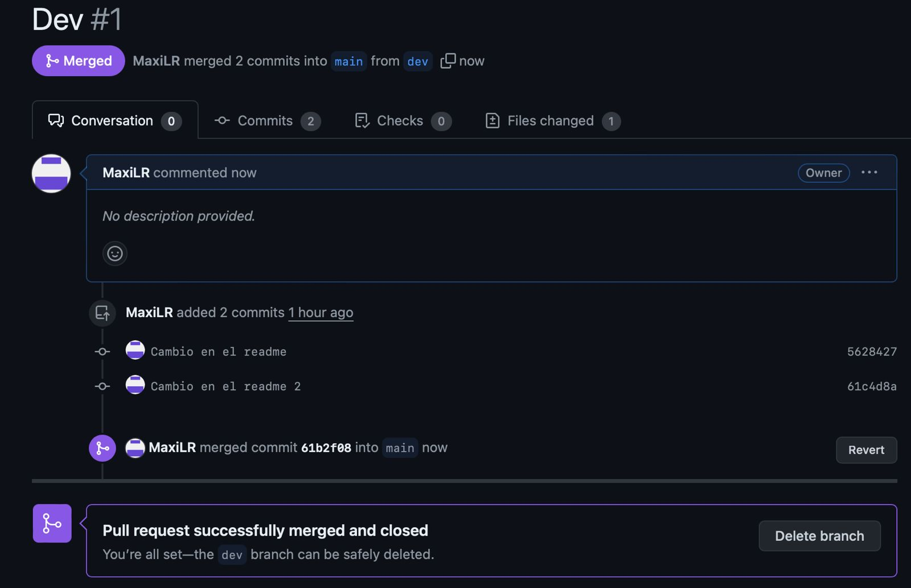  

## 10. Algunos ejercicios online
Entrar a la página [Learn Git Branching](https://learngitbranching.js.org/) y completar los ejercicios de la secuencia de introducción:  
   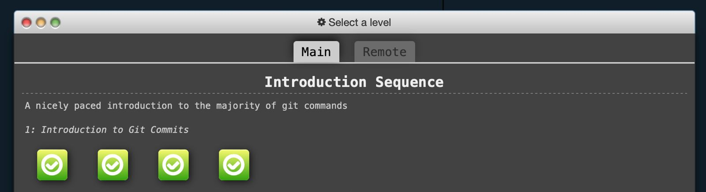
