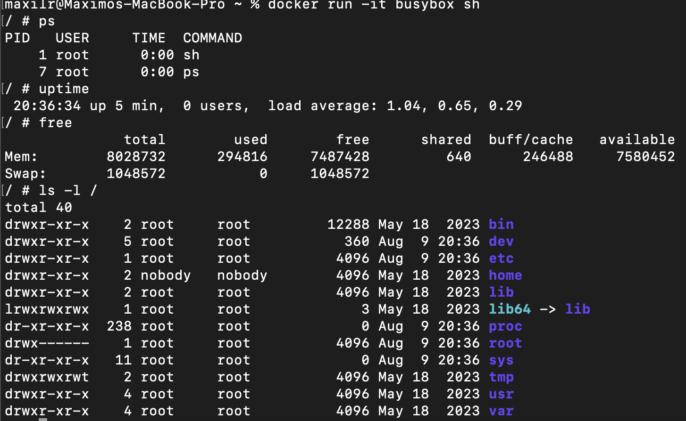

# Trabajo Práctico 2 - Introducción a Docker

## Desarrollo:

#### 1- Instalar Docker Community Edition

- Diferentes opciones para cada sistema operativo
- https://docs.docker.com/
- Ejecutar el siguiente comando para comprobar versiones de cliente y demonio.

  ```bash
  docker version
  ```

  

#### 2- Explorar DockerHub

- Registrase en docker hub: https://hub.docker.com/
- Familiarizarse con el portal  
  

#### 3- Obtener la images/imagen BusyBox

- Ejecutar el siguiente comando, para bajar una images/imagen de DockerHub

  ```bash
    docker pull busybox
  ```

  

- Verificar qué versión y tamaño tiene la images/imagen bajada, obtener una lista de imágenes locales:

  ```bash
  docker images/images
  ```

  

#### 4- Ejecutando contenedores

- Ejecutar un contenedor utilizando el comando **run** de docker:

  ```bash
  docker run busybox
  ```

  

- Explicar porque no se obtuvo ningún resultado

- Especificamos algún comando a correr dentro del contendor, ejecutar por ejemplo:

  ```bash
  docker run busybox echo "Hola Mundo"
  ```

  

- Ver los contendores ejecutados utilizando el comando **ps**:

  ```bash
  docker ps
  ```

  

- Vemos que no existe nada en ejecución, correr entonces:

  ```bash
  docker ps -a
  ```

- Mostrar el resultado y explicar que se obtuvo como salida del comando anterior.
    
  _Muestra todos los contenedores incluso los que no estan andando_

#### 5- Ejecutando en modo interactivo

- Ejecutar el siguiente comando

  ```bash
  docker run -it busybox sh
  ```

- Para cada uno de los siguientes comandos dentro de contenedor, mostrar los resultados:
  

  ```bash
  ps
  uptime
  free
  ls -l /
  ```

  

- Salimos del contendor con:

  ```bash
  exit
  ```

  

#### 6- Borrando contendores terminados

- Obtener la lista de contendores

  ```bash
  docker ps -a
  ```

  

- Para borrar podemos utilizar el id o el nombre (autogenerado si no se especifica) de contendor que se desee, por ejemplo:

  ```bash
  docker rm elated_lalande
  ```

  

- Para borrar todos los contendores que no estén corriendo, ejecutar cualquiera de los siguientes comandos:

  ```bash
  docker rm $(docker ps -a -q -f status=exited)
  ```

    

  ```bash
  docker container prune
  ```

  

#### 7- Construir una images/imagen
- Conceptos de DockerFile
  - Leer https://docs.docker.com/engine/reference/builder/ 
  - Describir las instrucciones
    - FROM: _Define la imagen base a partir de la cual se construye la nueva imagen._
    - RUN: _Ejecuta un comando en la imagen y guarda el resultado en una nueva capa._
    - ADD: _Copia archivos/directorios al contenedor, con descompresión automática de archivos._
    - COPY: _Copia archivos/directorios al contenedor sin descompresión._
    - EXPOSE: _Documenta los puertos en los que la aplicación escucha._
    - CMD: _Especifica el comando predeterminado que se ejecuta al iniciar el contenedor, que puede ser sobreescrito._
    - ENTRYPOINT: _Define un comando que siempre se ejecuta al iniciar el contenedor._
- A partir del código https://github.com/ingsoft3ucc/SimpleWebAPI crearemos una images/imagen.
- Clonar repo
  

- Crear images/imagen etiquetándola con un nombre. El punto final le indica a Docker que use el dir actual

  ```bash
  docker build –t mywebapi .
  ```

  

- Revisar Dockerfile y explicar cada línea  
  
- Ver imágenes disponibles  
  
- Ejecutar un contenedor con nuestra images/imagen  
  
- Subir images/imagen a nuestra cuenta de dockerhub  
  

#### 8- Publicando puertos

En el caso de aplicaciones web o base de datos donde se interactúa con estas aplicaciones a través de un puerto al cual hay que acceder, estos puertos están visibles solo dentro del contenedor. Si queremos acceder desde el exterior deberemos exponerlos.

- Ejecutar la siguiente images/imagen, en este caso utilizamos la bandera -d (detach) para que nos devuelva el control de la consola:

  ```bash
  docker run --name myapi -d mywebapi
  ```

  

- Ejecutamos un comando ps:
- Vemos que el contendor expone 3 puertos el 80, el 5254 y el 443, pero si intentamos en un navegador acceder a http://localhost/WeatherForecast no sucede nada.

  

- Procedemos entonces a parar y remover este contenedor:

  ```bash
  docker kill myapi
  docker rm myapi
  ```

  

- Vamos a volver a correrlo otra vez, pero publicando los puertos 80 y 5254

  ```bash
  docker run --name myapi -d -p 80:80 -p 5254:5254 mywebapi
  ```

  

- Accedamos nuevamente a http://localhost/WeatherForecast y a http://localhost/swagger/index.html y expliquemos que sucede.
    
  _Ahora los puertos del contenedor se encuentrar expuestos/mapeados a los mismos puertos pero de la maquina host, lo que nos permite accederlos gracias a la redireccion de puertos que se hace al realizar este mapeo._

#### 9- Modificar Dockerfile para soportar bash

- Modificamos dockerfile para que entre en bash sin ejecutar automaticamente la app

  ```bash
  # ENTRYPOINT ["dotnet", "SimpleWebAPI.dll"]
  CMD ["/bin/bash"]
  ```

  

- Rehacemos la images/imagen
  

- Corremos contenedor en modo interactivo exponiendo puerto

  ```bash
  docker run -it --rm -p 80:80 mywebapi
  ```

  

- Navegamos a http://localhost/weatherforecast
- Vemos que no se ejecuta automaticamente
  

- Ejecutamos app:

  ```bash
  dotnet SimpleWebAPI.dll
  ```

  

-Volvemos a navegar a http://localhost/weatherforecast


- Salimos del contenedor

#### 10- Montando volúmenes

Hasta este punto los contenedores ejecutados no tenían contacto con el exterior, ellos corrían en su propio entorno hasta que terminaran su ejecución. Ahora veremos cómo montar un volumen dentro del contenedor para visualizar por ejemplo archivos del sistema huésped:

- Ejecutar el siguiente comando, cambiar myusuario por el usuario que corresponda. En Mac puede utilizarse /Users/miusuario/temp):

  ```bash
  docker run -it --rm -p 80:80 -v /Users/miuser/temp:/var/tmp  mywebapi
  ```

  

- Dentro del contenedor correr

  ```bash
  ls -l /var/tmp
  touch /var/tmp/hola.txt
  ```

  

- Verificar que el Archivo se ha creado en el directorio del guest y del host.  
  

#### 11- Utilizando una base de datos

- Levantar una base de datos PostgreSQL

  ```bash
  mkdir $HOME/.postgres

  docker run --name my-postgres -e POSTGRES_PASSWORD=mysecretpassword -v $HOME/.postgres:/var/lib/postgresql/data -p 5432:5432 -d postgres:9.4
  ```

  

- Ejecutar sentencias utilizando esta instancia

  ```bash
  docker exec -it my-postgres /bin/bash

  psql -h localhost -U postgres
  ```

    

  ```bash
  #Estos comandos se corren una vez conectados a la base

  \l
  create database test;
  \connect test
  create table tabla_a (mensaje varchar(50));
  insert into tabla_a (mensaje) values('Hola mundo!');
  select * from tabla_a;

  \q

  exit
  ```

  

- Conectarse a la base utilizando alguna IDE (Dbeaver - https://dbeaver.io/, eclipse, IntelliJ, etc...). Interactuar con los objetos creados.
  
  

- Explicar que se logro con el comando `docker run` y `docker exec` ejecutados en este ejercicio.  
  _Con el `docker run` se levanto un contenedor con la images/imagen del servidor de la base de datos, en este caso PostgreSQL, se exporto una variable del sistema **POSTGRES_PASSWORD** que es la password de la base de datos, se creo un volumen para mapear directorio entre las maquinas guest y host, se mapearon los puerto 5432 de ambas y se ejecuto en modo detach para recuperar el acceso a la consola y no quedarse viendo los logs del contenedor.
  Con el `docker exec` abro una terminal dentro del contenedor que ya esta corriendo para tener acceso al mismo desde dentro y poder, si se quisiera, hablar con la base de datos para hacer consultas, como en este caso._

#### 12- Hacer el punto 11 con Microsoft SQL Server

- Armar un contenedor con SQL Server  
  
- Crear BD, Tablas y ejecutar SELECT  
    
    
    
  
