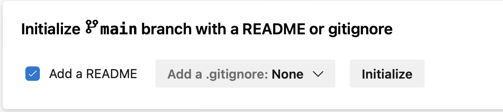
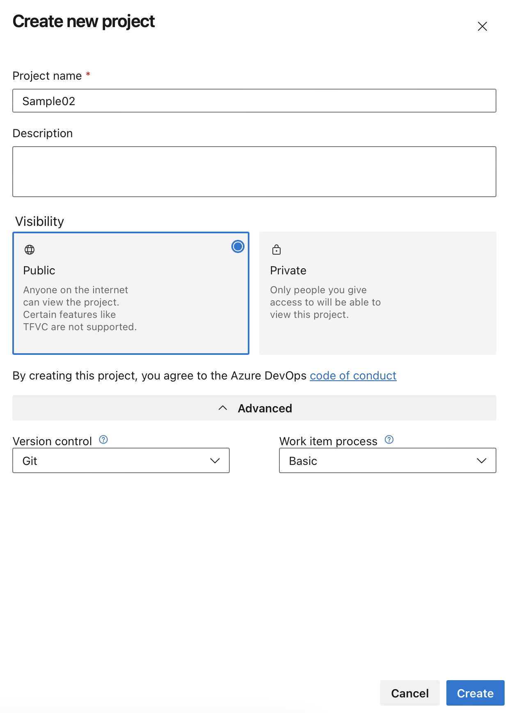
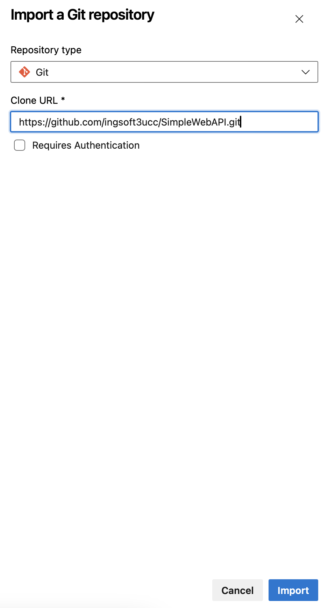
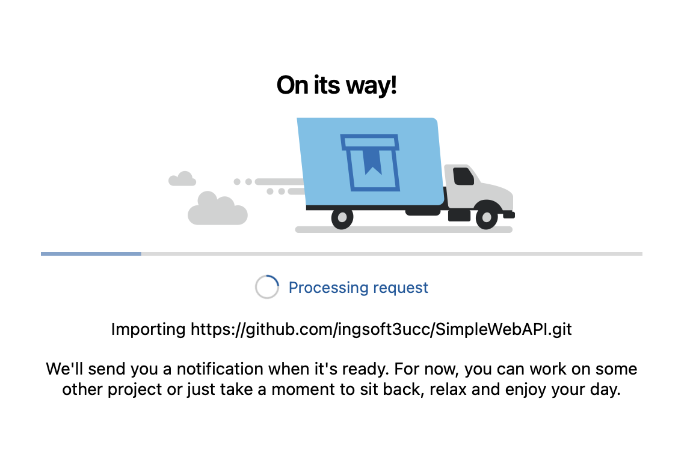
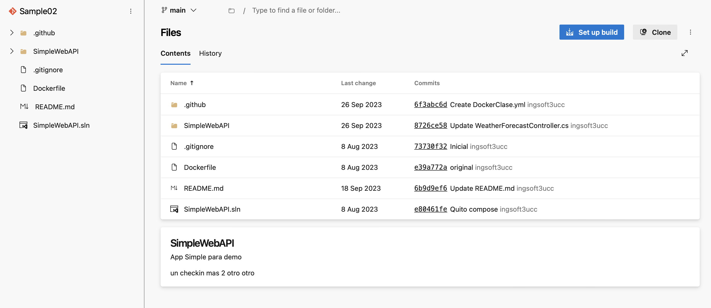

## Trabajo Práctico 3 - Introducción a Azure Devops

### Consignas a desarrollar en el trabajo práctico:

**¿Qué es Azure DevOps?**

- Breve descripción de Azure DevOps como un conjunto de herramientas para la colaboración en desarrollo de software.  
  _Azure DevOps es un conjunto de herramientas integradas de Microsoft que facilita la colaboración en el desarrollo de software. Ofrece servicios para la planificación de proyectos, control de versiones, integración continua, despliegue continuo (CI/CD), y gestión de pruebas, permitiendo a los equipos desarrollar, entregar y mantener aplicaciones de manera eficiente y colaborativa._
- Beneficios de utilizar Azure DevOps en comparación con otras soluciones.

- **Componentes Principales de Azure DevOps**
  - **Azure Repos**
    - Sistema de control de versiones con Git o TFVC.
    - Funcionalidades clave: branching, pull requests, code reviews.
  - **Azure Pipelines**
    - CI/CD (Integración Continua y Entrega Continua).
    - Creación y gestión de pipelines para la automatización de build, test y deploy.
  - **Azure Boards**
    - Gestión de proyectos con Kanban y Scrum.
    - Seguimiento de tareas, bugs, y trabajo en curso.
  - **Azure Artifacts**
    - Gestión de paquetes (NuGet, npm, Maven).
    - Uso de feeds para compartir artefactos entre equipos.
  - **Azure Test Plans**
    - Herramientas para pruebas manuales y automatizadas.
    - Gestión de casos de prueba y reportes de calidad.
- **Integración con otras herramientas**
  - GitHub, Jenkins, Docker, Kubernetes.
- **Marketplace de extensiones**
  - Añadir funcionalidades adicionales a Azure DevOps.

#### 3- Pasos del TP

- 3.1 Crear una cuenta en Azure DevOps  
  
- 3.2 Crear un repo GIT  
  
- 3.3 Crear un repo TFVC  
  
- 3.4 Importar un repo desde GitHub  
    
    
    
  
- 3.5 Clonarlo localmente  
  
- 3.6 Realizar un cambio en un archivo, y subirlo al repo de ADO.  
    
    
  
