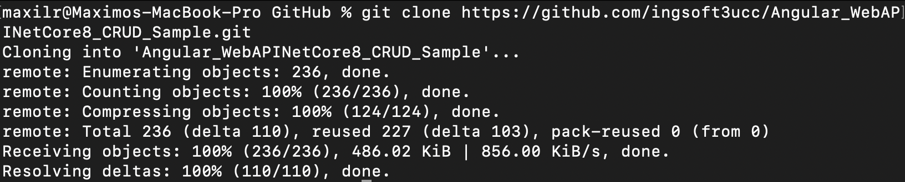
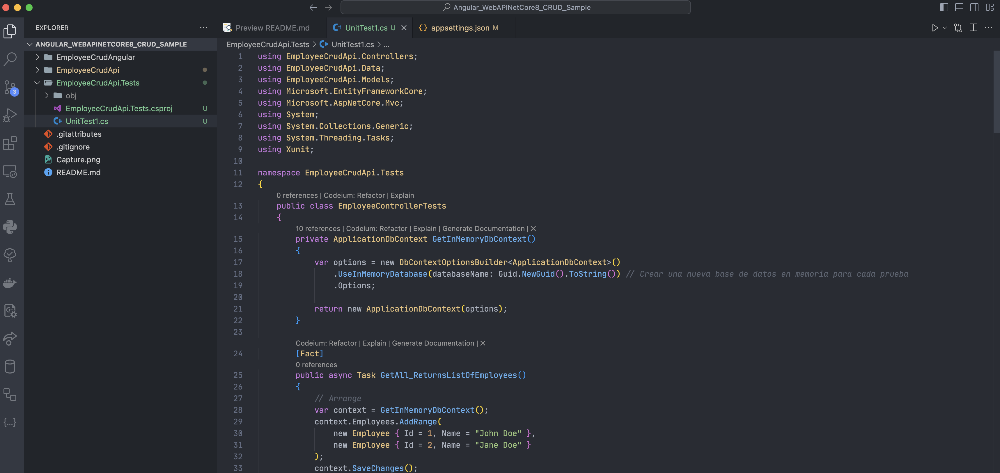
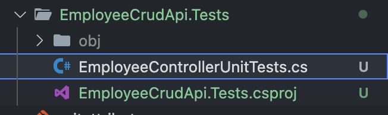
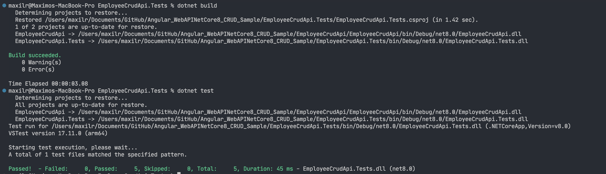

## Trabajo Práctico 6 - Pruebas Unitarias

### Desarrollo:

#### 4.1 Creación de una BD SQL Server para nuestra App

A\. Crear una BD Azure SQL Database (Ver Instructivo 5.1) o montar una imagen Docker de SQL Server como se solicitó en el punto 12 del [TP02]. (https://github.com/ingsoft3ucc/TPS_2024/blob/main/trabajos/02-introduccion-docker.md)
  

B\. En caso de optar por la opción de montar la imagen de docker, una vez levantada el contenedor, conectarse y ejecutar el siguiente script:
  

#### 4.2 Obtener nuestra App

A\. Clonar el repo https://github.com/ingsoft3ucc/Angular_WebAPINetCore8_CRUD_Sample.git
  

B\. Seguir las instrucciones del README.md del repo clonado prestando atención a la modificación de la cadena de conexión en el appSettings.json para que apunte a la BD creada en 4.1
  
  

C\. Navegar a http://localhost:7150/swagger/index.html y probar uno de los controladores para verificar el correcto funcionamiento de la API.
  
  

D\. Navegar a http://localhost:4200 y verificar el correcto funcionamiento de nuestro front-end Angular
  

#### 4.3 Crear Pruebas Unitarias para nuestra API

A\. En el directorio raiz de nuestro repo crear un nuevo proyecto de pruebas unitarias para nuestra API
  

B\. Instalar dependencias necesarias
  

C\. Editar archivo UnitTest1.cs reemplazando su contenido por
  

D\. Renombrar archivo UnitTest1.cs por EmployeeControllerUnitTests.cs
  

E\. Editar el archivo EmployeeCrudApi.Tests/EmployeeCrudApi.Tests.csproj para agregar una referencia a nuestro proyecto de EmployeeCrudApi reemplazando su contenido por
  

F\. Ejecutar los siguientes comandos para ejecutar nuestras pruebas. G\. Verificar que se hayan ejecutado correctamente las pruebas
  

H\. Verificar que no estamos usando una dependencia externa como la base de datos. I\. Modificar la cadena de conexión en el archivo appsettings.json para que use un usuario o password incorrecto y recompilar el proyecto EmployeeCrudApi
  
  

J\. Verificar que nuestro proyecto ya no tiene acceso a la BD navegando a http://localhost:7150/swagger/index.html y probando uno de los controladores:
  

K\. En la carpeta de nuestro proyecto EmployeeCrudApi.Tests volver a correr las pruebas. L\. Verificar que se hayan ejecutado correctamente las pruebas inclusive sin tener acceso a la BD, lo que confirma que es efectivamente un conjunto de pruebas unitarias que no requieren de una dependencia externa para funcionar.
  

M\. Modificar la cadena de conexión en el archivo appsettings.json para que use el usuario y password correcto y recompilar el proyecto EmployeeCrudApi
  
  

N\. Verificar que nuestro proyecto vuelve a tener acceso a la BD navegando a http://localhost:7150/swagger/index.html y probando uno de los controladores:
  

#### 4.4 Creamos pruebas unitarias para nuestro front de Angular:

A\. Nos posicionamos en nuestro proyecto de front, en el directorio EmployeeCrudAngular/src/app
  

B\. Editamos el archivo app.component.spec.ts reemplazando su contenido por:
  

C\. Creamos el archivo employee.service.spec.ts reemplazando su contenido por:
  

D\. Editamos el archivo employee.component.spec.ts ubicado en la carpeta **employee** reemplazando su contenido por:
  

E\. Editamos el archivo addemployee.component.spec.ts ubicado en la carpeta **addemployee** reemplazando su contenido por:
  

F\. En el directorio raiz de nuestro proyecto EmployeeCrudAngular ejecutamos el comando ng test. G\. Vemos que se abre una ventana de Karma con Jasmine en la que nos indica que los tests se ejecutaron correctamente
  

H\. Vemos que los tests se ejecutaron correctamente:
  

I\. Verificamos que no esté corriendo nuestra API navegando a http://localhost:7150/swagger/index.html y recibiendo esta salida:
  

#### 4.5 Agregamos generación de reporte XML de nuestras pruebas de front.

A\. Instalamos dependencia karma-junit-reporter
  

B\. En el directorio raiz de nuestro proyecto (al mismo nivel que el archivo angular.json) creamos un archivo karma.conf.js con el siguiente contenido
  

C\. Ejecutamos nuestros test de la siguiente manera:
  

D\. Verificamos que se creo un archivo test-result.xml en el directorio test-results que está al mismo nivel que el directorio src
  

#### 4.6 Modificamos el código de nuestra API y creamos nuevas pruebas unitarias:

A\. Realizar al menos 5 de las siguientes modificaciones sugeridas al código de la API:

- La longitud máxima del nombre y apellido del empleado debe ser de 100 caracteres.
- Validar que el nombre tenga un número mínimo de caracteres, por ejemplo, al menos dos caracteres para evitar entradas inválidas como "A".
- Verificar que el nombre no contenga números, ya que no es común en los nombres de empleados.
- Verificar que no haya palabras vacías o que el nombre no esté compuesto solo de espacios.
- Asegurar que cada parte del nombre (separada por espacios) tenga al menos un carácter o más, por ejemplo, para evitar "A B".

  

B\. Crear las pruebas unitarias necesarias para validar las modificaciones realizadas en el código

```cs
using EmployeeCrudApi.Controllers;
using EmployeeCrudApi.Data;
using EmployeeCrudApi.Models;
using Microsoft.EntityFrameworkCore;
using Microsoft.AspNetCore.Mvc;
using System;
using System.Collections.Generic;
using System.Threading.Tasks;
using Xunit;

namespace EmployeeCrudApi.Tests
{
    public class EmployeeControllerTests
    {
        private ApplicationDbContext GetInMemoryDbContext()
        {
            var options = new DbContextOptionsBuilder<ApplicationDbContext>()
                .UseInMemoryDatabase(databaseName: Guid.NewGuid().ToString()) // Crear una nueva base de datos en memoria para cada prueba
                .Options;

            return new ApplicationDbContext(options);
        }

        [Fact]
        public async Task GetAll_ReturnsListOfEmployees()
        {
            // Arrange
            var context = GetInMemoryDbContext();
            context.Employees.AddRange(
                new Employee { Id = 1, Name = "John Doe" },
                new Employee { Id = 2, Name = "Jane Doe" }
            );
            context.SaveChanges();

            var controller = new EmployeeController(context);

            // Act
            var result = await controller.GetAll();

            // Assert
            Assert.Equal(2, result.Count);
            Assert.Equal("John Doe", result[0].Name);
            Assert.Equal("Jane Doe", result[1].Name);
        }

        [Fact]
        public async Task GetById_ReturnsEmployeeById()
        {
            // Arrange
            var context = GetInMemoryDbContext();
            context.Employees.Add(new Employee { Id = 1, Name = "John Doe" });
            context.SaveChanges();

            var controller = new EmployeeController(context);

            // Act
            var result = await controller.GetById(1);

            // Assert
            Assert.NotNull(result);
            Assert.Equal(1, result.Id);
            Assert.Equal("John Doe", result.Name);
        }

        [Fact]
        public async Task Create_AddsEmployee()
        {
            // Arrange
            var context = GetInMemoryDbContext();
            var controller = new EmployeeController(context);

            var newEmployee = new Employee { Id = 3, Name = "New Employee" };

            // Act
            await controller.Create(newEmployee);

            // Assert
            var employee = await context.Employees.FindAsync(3);
            Assert.NotNull(employee);
            Assert.Equal("New Employee", employee.Name);
        }

        [Fact]
        public async Task Create_AddsEmployee_WithMaxLengthName()
        {
            // Arrange
            var context = GetInMemoryDbContext();
            var controller = new EmployeeController(context);

            var maxLengthName = new string('A', 100); // Nombre de 100 caracteres
            var newEmployee = new Employee { Id = 4, Name = maxLengthName};

            // Act
            var result = await controller.Create(newEmployee);

            // Assert
            var employee = await context.Employees.FindAsync(4);
            Assert.NotNull(employee);
            Assert.Equal(maxLengthName, employee.Name);
        }

        [Fact]
        public async Task Create_ReturnsBadRequest_ForNameWithSingleCharacter()
        {
            // Arrange
            var context = GetInMemoryDbContext();
            var controller = new EmployeeController(context);

            var newEmployee = new Employee { Id = 5, Name = "A"};

            // Act
            var result = await controller.Create(newEmployee);

            // Assert
            Assert.IsType<BadRequestObjectResult>(result);
        }

        [Fact]
        public async Task Create_ReturnsBadRequest_ForNameWithNumbers()
        {
            // Arrange
            var context = GetInMemoryDbContext();
            var controller = new EmployeeController(context);

            var newEmployee = new Employee { Id = 6, Name = "John123"};

            // Act
            var result = await controller.Create(newEmployee);

            // Assert
            Assert.IsType<BadRequestObjectResult>(result);
        }


        [Fact]
        public async Task Create_ReturnsBadRequest_ForEmptyName()
        {
            // Arrange
            var context = GetInMemoryDbContext();
            var controller = new EmployeeController(context);

            var newEmployee = new Employee { Id = 7, Name = "   "}; // Nombre vacío o solo con espacios

            // Act
            var result = await controller.Create(newEmployee);

            // Assert
            Assert.IsType<BadRequestObjectResult>(result);
        }

        [Fact]
        public async Task Create_ReturnsBadRequest_ForNameWithSingleCharacterParts()
        {
            // Arrange
            var context = GetInMemoryDbContext();
            var controller = new EmployeeController(context);

            var newEmployee = new Employee { Id = 8, Name = "A B"};

            // Act
            var result = await controller.Create(newEmployee);

            // Assert
            Assert.IsType<BadRequestObjectResult>(result);
        }


        [Fact]
        public async Task Update_UpdatesEmployee()
        {
            // Arrange
            var context = GetInMemoryDbContext();
            var existingEmployee = new Employee { Id = 1, Name = "Old Name" };
            context.Employees.Add(existingEmployee);
            context.SaveChanges();

            var controller = new EmployeeController(context);

            var updatedEmployee = new Employee { Id = 1, Name = "Updated Name" };

            // Act
            await controller.Update(updatedEmployee);

            // Assert
            var employee = await context.Employees.FindAsync(1);
            Assert.NotNull(employee);
            Assert.Equal("Updated Name", employee.Name);
        }

        [Fact]
        public async Task Delete_RemovesEmployee()
        {
            // Arrange
            var context = GetInMemoryDbContext();
            var employeeToDelete = new Employee { Id = 1, Name = "John Doe" };
            context.Employees.Add(employeeToDelete);
            context.SaveChanges();

            var controller = new EmployeeController(context);

            // Act
            await controller.Delete(1);

            // Assert
            var employee = await context.Employees.FindAsync(1);
            Assert.Null(employee); // Verifica que el empleado fue eliminado
        }
    }
}
```

  

#### 4.7 Modificamos el código de nuestro Front y creamos nuevas pruebas unitarias:

A\. Realizar en el código del front las mismas modificaciones hechas a la API. B\. Las validaciones deben ser realizadas en el front sin llegar a la API, y deben ser mostradas en un toast como por ejemplo https://stackblitz.com/edit/angular12-toastr?file=src%2Fapp%2Fapp.component.ts o https://stackblitz.com/edit/angular-error-toast?file=src%2Fapp%2Fcore%2Frxjsops.ts

Instalamos la libreria de toast.
  
  

Abrimos el archivo src/app/app.config.ts y agregamos las importaciones necesarias para ToastrModule y BrowserAnimationsModule.
  

Importamos el CSS con los estilos de los toast.
  

Agregamos las validaciones en AddEmployee y las probamos.
  

Probamos las 5 validaciones.
  
  
  
  
  

C\. Crear las pruebas unitarias necesarias en el front para validar las modificaciones realizadas en el código del front.

Creamos las pruebas unitarias en addemployee.component.spec.ts
  

Las ejecutamos
  
  

### Subir el proyecto

https://github.com/MaxiLR/AngularCrud-UnitTests

### Criterio de Calificación

Los pasos 4.1 al 4.5 representan un 60% de la nota total, los pasos 4.6 y subsiguientes representan el 40% restante.
