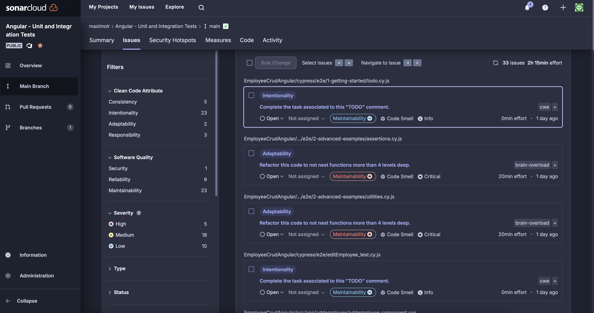
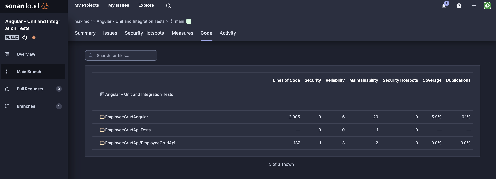
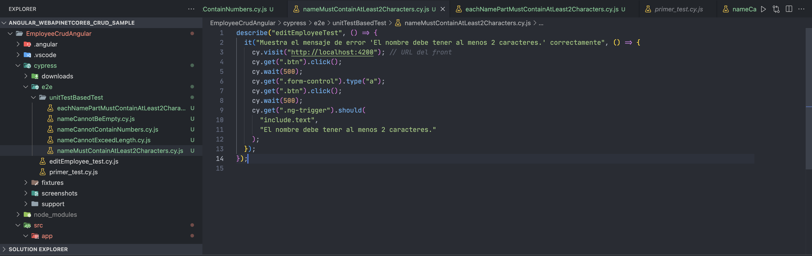
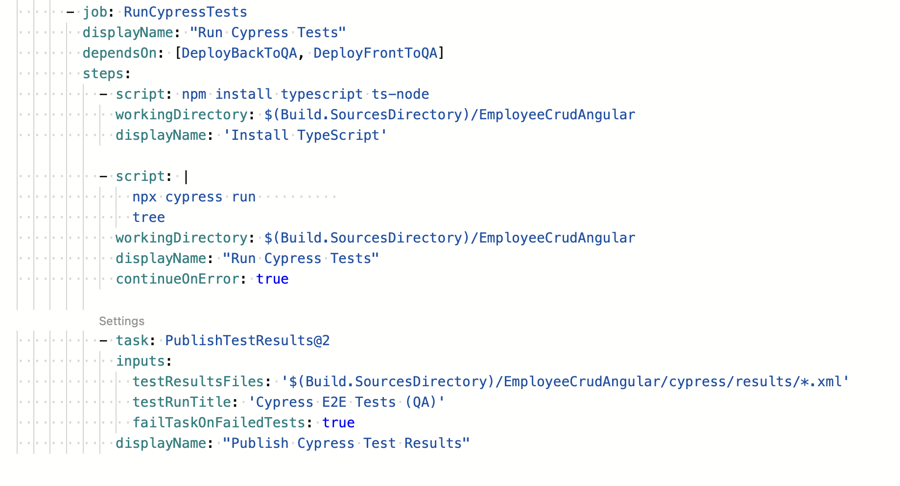
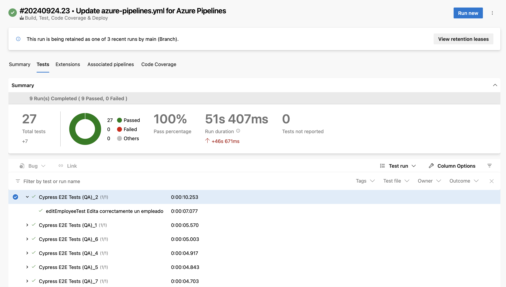
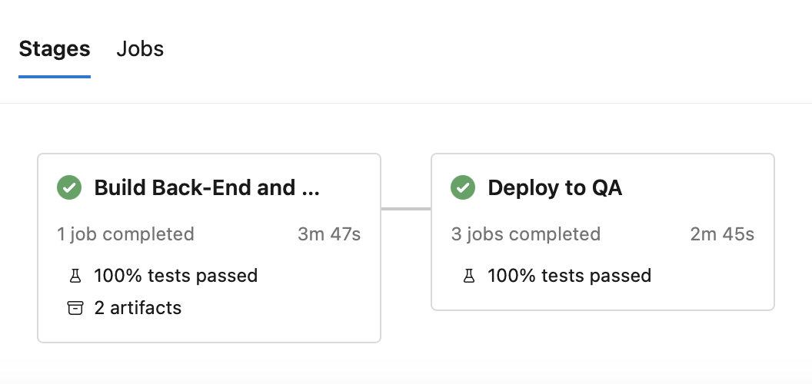
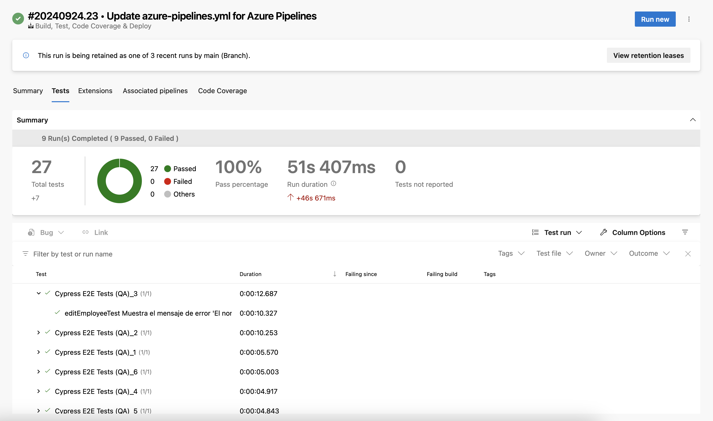
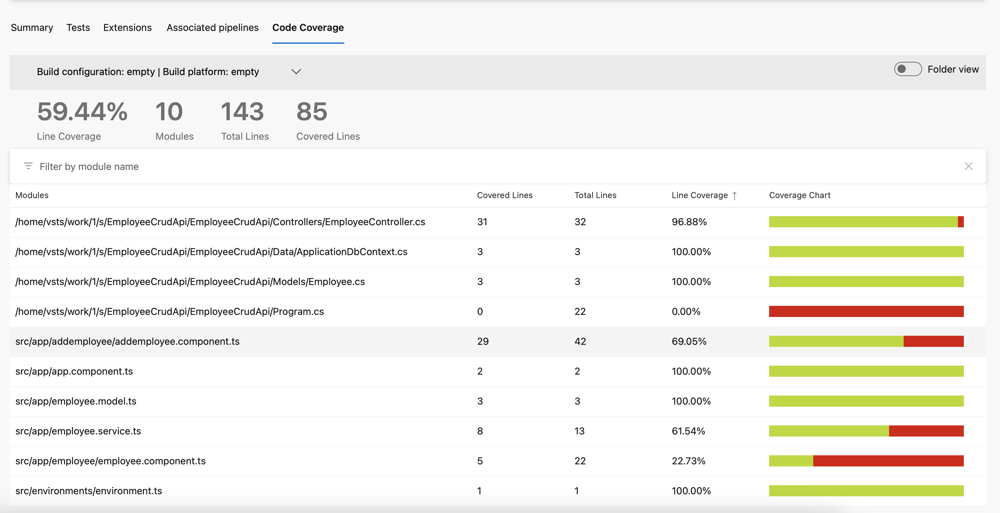
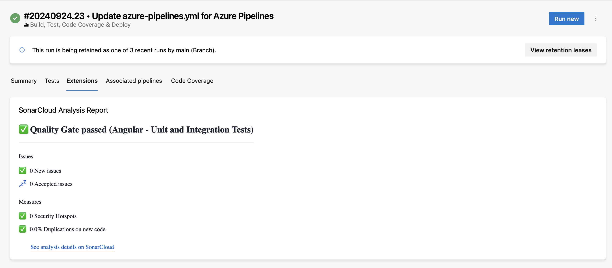

## Trabajo Práctico 7 - Code Coverage, Análisis estático de Código y Pruebas de Integración

### Desarrollo:

#### 4.1 Agregar Code Coverage a nuestras pruebas unitarias de backend y front-end e integrarlas junto con sus resultados en nuestro pipeline de build.

##### 4.1.1 En el directorio raiz de nuestro proyecto Angular instalar el siguiente paquete:

 

##### 4.1.2 Editar nuestro archivo karma.conf.js para que incluya reporte de cobertura

 

##### 4.1.3 En el dir raiz del proyecto EmployeeCrudApi.Tests ejecutar:

 

##### 4.1.4 Agregar a nuestro pipeline ANTES del Build de Back la tarea de test con los argumentos especificados y la de publicación de resultados de cobertura:

 

##### 4.1.5 Agregar a nuestro pipeline ANTES del Build de front la tarea de test y la de publicación de los resultados.

 

##### 4.1.6 Ejecutar el pipeline y analizar el resultado de las pruebas unitarias y la cobertura de código.

 
 
 
 
 

#### 4.2 Agregar Análisis Estático de Código con SonarCloud:

##### 4.2.1 Integraremos SonarCloud para analizar el código fuente. Configurar SonarCloud en nuestro pipeline siguiendo instructivo 5.1

- Antes de nuestra tarea de Build del Back:
   

- Despues de nuestra tarea de Build del Back:
   

 

##### 4.2.2 Vemos el resultado de nuestro pipeline, en extensions tenemos un link al análisis realizado por SonarCloud

 

##### 4.2.3 Ir al link y analizar toda la información obtenida. Detallar en la entrega del TP los puntos más relevantes del informe, qué significan y para qué sirven.

 

1. Clean Code Attributes

   - Consistencia: Señala si el código sigue un estilo coherente y consistente. La consistencia es crucial para que el código sea más legible y mantenible. En tu informe, menciona la importancia de mantener un estilo uniforme en el código para mejorar su legibilidad y reducir errores.
   - Intencionalidad: Se refiere a si el código expresa claramente su propósito. Un código con intencionalidad facilita la comprensión y el mantenimiento. Explica cómo la intencionalidad en el código ayuda a otros desarrolladores a entender rápidamente el propósito y funcionamiento del mismo.
   - Adaptabilidad y Responsabilidad: Aunque Adaptabilidad tiene 0 problemas, Responsabilidad tiene 3. La Adaptabilidad indica qué tan fácil es modificar el código para adaptarse a cambios, mientras que la Responsabilidad evalúa si cada clase o método tiene una sola responsabilidad. Destaca cómo una alta responsabilidad ayuda a mantener un código limpio y modular.

2. Software Quality Attributes

   - Seguridad: Muestra problemas relacionados con la seguridad del código. Identificar y corregir problemas de seguridad es fundamental para evitar vulnerabilidades. Resalta en tu informe la importancia de la seguridad en el desarrollo de software.
   - Confiabilidad: Indica la capacidad del software para funcionar correctamente bajo condiciones esperadas. La confiabilidad es esencial para asegurar que la aplicación sea estable y funcione como se espera.
   - Mantenibilidad: Evalúa cuán fácil es mantener el código. Un código fácil de mantener reduce el tiempo y esfuerzo necesarios para aplicar cambios o corregir errores.

3. Severidad de los Problemas

   - Alta, Media, Baja: Son las categorías que indican la gravedad de los problemas encontrados. La mayoría de los problemas son de severidad alta y media, lo que indica áreas críticas que requieren atención inmediata. Explica la importancia de priorizar la resolución de problemas de alta severidad para evitar futuros inconvenientes y mejorar la calidad del software.

4. Tipos de Problemas

   - Code Smells: Los “code smells” son indicativos de posibles problemas en el código que no necesariamente son errores, pero podrían llevar a ellos o dificultar el mantenimiento. Ejemplos incluyen métodos grandes, duplicación de código, y mal uso de las estructuras del lenguaje.
   - En el informe, puedes hablar sobre cómo los “code smells” son señales tempranas de problemas que deben abordarse para mejorar la salud general del código.

5. Ejemplos Específicos de Problemas

   - GetInMemoryDbContext: Esta alerta indica que el método no accede a los datos de la instancia y podría ser marcado como static. Este tipo de optimización puede mejorar el rendimiento y claridad del código.
   - Readonly Context: Sugiere hacer el contexto \_context readonly, lo cual es una buena práctica para proteger la integridad de los datos y evitar modificaciones accidentales.
   - Uso de GeneratedRegexAttribute: Recomienda usar esta función para mejorar el rendimiento en tiempo de compilación, lo que puede ser crucial para optimizar el rendimiento del software.

6. Esfuerzo Estimado

   - SonarCloud proporciona un tiempo estimado para resolver cada problema. Esto ayuda a priorizar el trabajo y planificar las tareas necesarias para mejorar el código.
   - En tu informe, podrías discutir cómo este tiempo estimado puede ser útil para la gestión del proyecto, permitiendo una asignación más efectiva de los recursos.

7. Impacto en el Proyectoc

   - Por qué es Importante: La información obtenida de SonarCloud es crucial para mantener la calidad del código, mejorar la mantenibilidad, y evitar errores futuros. Los problemas de seguridad y confiabilidad deben abordarse con prioridad para asegurar que la aplicación sea segura y funcione correctamente.
   - Uso Práctico: El informe generado por SonarCloud permite a los desarrolladores identificar y corregir problemas temprano, lo que lleva a un código más limpio, eficiente y seguro.

#### 4.3 Pruebas de Integración con Cypress:

##### 4.3.1 En el directorio raiz de nuestro proyecto Angular instalar el siguiente paquete:

 

##### 4.3.2 Abrir Cypress:

 

##### 4.3.3 Inicializar Cypress en nuestro proyecto como se indica en el instructivo 5.2

 

##### 4.3.4 Crear nuestra primera prueba navegando a nuestro front.

 

##### 4.3.5 Correr nuestra primera prueba

 
 

##### 4.3.6 Modificar nuestra prueba para que falle.

- Editamos el archivo primer_test.cy.js y hacemos que espere otra cosa en el título
   

- Ejecutamos cypress en modo headless
   

Captura de pantalla de la prueba fallida
 

##### 4.3.6 Grabar nuestras pruebas para que Cypress genere código automático y genere reportes:

- Editamos el archivo cypress.config.ts incluyendo la propiedad **experimentalStudio** en true y la configuración de reportería.
   

- Corremos nuevamente Cypress con npx cypress open, una vez que se ejecute nuestra prueba tendremos la opción de "Add Commands to Test". Esto permitirá interactuar con la aplicación y generar automáticamente comandos de prueba basados en las interacciones con la página:
   
   

- Por ejemplo, si agregamos un nuevo empleado y luego verificamos que esté en la lista, Cypress nos generará un código como este:
   
   

- Por supuesto que habrá que hacerle ajustes, como por ejemplo que se fije siempre en la última fila de la grilla y no en la posición 15 como lo grabó, es ahí cuando consultando la documentación de Cypress debemos ver cómo modificar el código, en nuestro caso de ejemplo sería así:
   

##### 4.3.7 Hacemos prueba de editar un empleado

- Creamos en cypress/e2e/ un archivo editEmployee_test.cy.js con el siguiente contenido, guardamos y aparecerá en Cypress:
   

- Hacemos "Add command to the test" y empezamos a interactuar con la página
   

- Hacemos algunos ajustes al código generado:
   
   

#### 4.4 Desafíos:

- Integrar en el pipeline SonarCloud para nuestro proyecto Angular, mostrar el resultado obtenido en SonarCloud
   
   
- Implementar en Cypress pruebas de integración que incluya los casos desarrollados como pruebas unitarias del front en el TP06.
   
- Incorporar al pipeline de Deploy la ejecución de las pruebas de integración y la visualización de sus resultados.
   
   
- **Resultado esperado**:

  - Un Pipeline en YAML que incluya a) Build de QA y Front con ejecución y resultado de pruebas de code coverage, pruebas unitarias y análisis de Sonar Cloud y b) Deploy a WebApp(s) de QA y Front que incluya ejecución y resultado de pruebas de integración

  - Dos Stages: Una para Build, Test Unitarios, Code Coverage y SonarCloud y otra para el Deploy a QA con Tests de Integración
     

  - En la pestaña Test, poder visualizar los Test Unitarios de Front y Back y los Test de Integracion:
     

  - En la pestaña Code Coverage, visualizar la cobertura de las pruebas unitarias de Back y de Front:
     

  - En la pestaña Extensions, ver el análisis de SonarCloud en verde
     
    Nota: Estan los dos analisis en el mismo proyecto de SonarCloud

#### Análisis de Código en SonarCloud

El análisis realizado en SonarCloud ha revelado diversos problemas relacionados con la mantenibilidad, consistencia y fiabilidad del código. Estos problemas se clasifican como “Code Smells”, los cuales no representan errores críticos pero sí indican áreas donde el código puede ser mejorado para evitar problemas futuros o facilitar su comprensión y mantenimiento.

##### 1. Mantenibilidad

- **Controladores/EmployeeController.cs**:
  - Se detectó un problema en la declaración de la variable `_context` que debería ser declarada como `readonly` para evitar modificaciones no intencionadas. Esto mejora la intencionalidad del código, aclarando que el estado de esa variable no debería cambiar una vez inicializada. Este ajuste es sencillo de implementar, con un esfuerzo estimado de 2 minutos.
  - Se recomienda también utilizar el atributo `GeneratedRegexAttribute` para la generación de expresiones regulares en tiempo de compilación, lo cual optimiza el rendimiento y facilita la legibilidad. La corrección de este problema es mínima y mejora la consistencia del código, manteniéndolo más alineado con las mejores prácticas de C#.

##### 2. Fiabilidad

- **Modelos/Employee.cs**:
  - Se encontró una advertencia que señala que las propiedades de tipo valor, usadas en una acción del controlador, deberían ser nullable, requeridas o anotadas con el atributo `JsonRequiredAttribute`. Esto ayuda a evitar el problema conocido como under-posting, donde las propiedades pueden no ser enviadas o deserializadas correctamente en las solicitudes HTTP. Estas correcciones aseguran que el modelo de datos es robusto y previene posibles errores en la comunicación entre el cliente y el servidor.

##### 3. Prioridad de Resolución

- **Mayor Mantenimiento y Consistencia**: Las advertencias de SonarCloud sugieren que los problemas relacionados con la mantenibilidad son más simples de abordar, pero importantes para la claridad y la robustez del código a largo plazo.
- **Mayor Fiabilidad en los Modelos**: Las advertencias sobre la necesidad de manejar correctamente las propiedades de los modelos representan riesgos más significativos para la lógica de negocio y la integridad de los datos, por lo que deben ser atendidos para prevenir posibles fallos en la API o durante la deserialización de datos.

##### 4. Pruebas de Cobertura

El análisis de cobertura indica un 59.44% de líneas cubiertas por pruebas. Los archivos clave como `EmployeeController.cs` y `ApplicationDbContext.cs` tienen alta cobertura (96.88% y 100%, respectivamente), lo que asegura la correcta funcionalidad del CRUD y la conexión a la base de datos. Sin embargo, archivos como `Program.cs` (0%) y `employee.component.ts` (22.73%) presentan baja o nula cobertura, representando un riesgo potencial en la inicialización de la aplicación y en el frontend. Se recomienda aumentar la cobertura en estas áreas críticas para mejorar la fiabilidad del sistema.

### Criterio de Calificación

Los pasos 4.1 al 4.3 representan un 60% de la nota total, los pasos 4.4 y subsiguientes representan el 40% restante.
