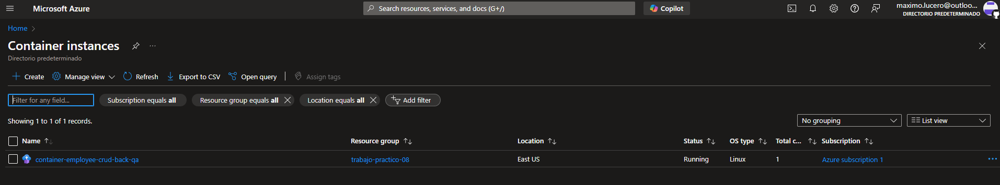

## Trabajo Práctico 8 - Implementación de Contenedores en Azure y Automatización con Azure CLI

### Desarrollo:

#### 4.1 Modificar nuestro pipeline para construir imágenes Docker de back y front y subirlas a ACR

##### 4.1.1 Crear archivos DockerFile para nuestros proyectos de Back y Front

##### 4.1.2 Crear un recurso ACR en Azure Portal siguiendo el instructivo 5.1

##### 4.1.3 Modificar nuestro pipeline en la etapa de Build y Test

- Luego de la tarea de publicación de los artefactos de Back agregar la tarea de publicación de nuestro dockerfile de back para que esté disponible en etapas posteriores y luego de la tarea de publicación de los artefactos de Front agregar la tarea de publicación de nuestro dockerfile de front para que esté disponible en etapas posteriores:

##### 4.1.4 En caso de no contar en nuestro proyecto con una ServiceConnection a Azure Portal para el manejo de recursos, agregar una service connection a Azure Resource Manager como se indica en instructivo 5.2

##### 4.1.5 Agregar a nuestro pipeline variables

##### 4.1.6 Agregar a nuestro pipeline una nueva etapa que dependa de nuestra etapa de Build y Test

- Agregar tareas para generar imagen Docker de Back
  

##### 4.1.7 - Ejecutar el pipeline y en Azure Portal acceder a la opción Repositorios de nuestro recurso Azure Container Registry. Verificar que exista una imagen con el nombre especificado en la variable backImageName asignada en nuestro pipeline

##### 4.1.8 - Agregar tareas para generar imagen Docker de Front (DESAFIO)

- A la etapa creada en 4.1.6 Agregar tareas para generar imagen Docker de Front

##### 4.1.9 - Agregar a nuestro pipeline una nueva etapa que dependa de nuestra etapa de Construcción de Imagenes Docker y subida a ACR

- Agregar variables a nuestro pipeline:
  

- Agregar variable secreta cnn-string-qa desde la GUI de ADO que apunte a nuestra BD de SQL Server de QA como se indica en el instructivo 5.3
  
  Cambios necesarios para variabilizar los ConnectionString y demas referencias a variables de entorno: [5873ce91](https://dev.azure.com/maximolr/Angular%20-%20Unit%20and%20Integration%20Tests/_git/Angular%20-%20Unit%20and%20Integration%20Tests/commit/5873ce917c316514d261d7fa92a5e5b125546bab?refName=refs%2Fheads%2Fmain)

- Agregar tareas para crear un recurso Azure Container Instances que levante un contenedor con nuestra imagen de back
  

##### 4.1.10 - Ejecutar el pipeline y en Azure Portal acceder al recurso de Azure Container Instances creado. Copiar la url del contenedor y navegarlo desde browser. Verificar que traiga datos.

- Prerrequisitos para poder crear Azure Container Instances desde Azure CLI:
  
  

- Desarrollo:

##### 4.1.11 - Agregar tareas para generar un recurso Azure Container Instances que levante un contenedor con nuestra imagen de front (DESAFIO)

- A la etapa creada en 4.1.9 Agregar tareas para generar contenedor en ACI con nuestra imagen de Front
- Tener en cuenta que el contenedor debe recibir como variable de entorno API_URL el valor de una variable container-url-api-qa definida en nuestro pipeline.

- Para que el punto anterior funcione el código fuente del front debe ser modificado para que la url de la API pueda ser cambiada luego de haber sido construída la imagen. Se deja un ejemplo de las modificaciones a realizar en el repo https://github.com/ingsoft3ucc/CrudAngularConEnvironment.git

##### 4.1.12 - Agregar tareas para correr pruebas de integración en el entorno de QA de Back y Front creado en ACI.

##### 4.1.13 - Agregar etapa que dependa de la etapa de Deploy en ACI QA y genere contenedores en ACI para entorno de PROD.
