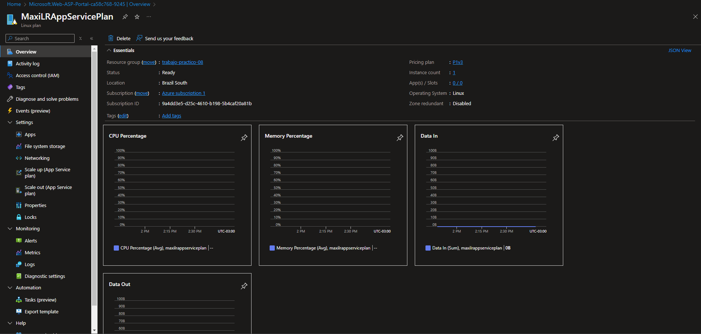

## Trabajo Práctico 9 - Implementación de Contenedores en Azure Parte 2

### Desafio Azure ContainerApps

- Pipeline: https://dev.azure.com/maximolr/Angular%20-%20Unit%20and%20Integration%20Tests/_build/results?buildId=270&view=results

### Fallo de los test interrumpe la ejecucion del Pipeline

#### Back-End


#### Front-End


### Pipeline URL

Hasta 4.2.4: https://dev.azure.com/maximolr/Angular%20-%20Unit%20and%20Integration%20Tests/_build/results?buildId=249&view=results
4.2.5: https://dev.azure.com/maximolr/Angular%20-%20Unit%20and%20Integration%20Tests/_build/results?buildId=264&view=results

### 4- Desarrollo:

#### 4.1 Modificar nuestro pipeline para incluir el deploy en QA y PROD de Imagenes Docker en Servicio Azure App Services con Soporte para Contenedores

- Creamos App Service Plan:
  
  

- Desarrollo del punto 4.1:
  
  
  

#### 4.2 Desafíos:

- 4.2.1 Agregar tareas para generar Front en Azure App Service con Soporte para Contenedores
  
  
- 4.2.2 Agregar variables necesarias para el funcionamiento de la nueva etapa considerando que debe haber 2 entornos QA y PROD para Back y Front.
  
- 4.2.3 Agregar tareas para correr pruebas de integración en el entorno de QA de Back y Front creado en Azure App Services con Soporte para Contenedores.
  
- 4.2.4 Agregar etapa que dependa de la etapa de Deploy en QA que genere un entorno de PROD.
  
  
  
  
  
  
- 4.2.5 Entregar un pipeline que incluya:

  - A) Etapa Construcción y Pruebas Unitarias y Code Coverage Back y Front
  - B) Construcción de Imágenes Docker y subida a ACR
  - C) Deploy Back y Front en QA con pruebas de integración para Azure Web Apps
  - D) Deploy Back y Front en QA con pruebas de integración para ACI
  - E) Deploy Back y Front en QA con pruebas de integración para Azure Web Apps con Soporte para contenedores
  - F) Aprobación manual de QA para los puntos C,D,E
  - G) Deploy Back y Front en PROD para Azure Web Apps
  - H) Deploy Back y Front en PROD para ACI
  - I) Deploy Back y Front en PROD para Azure Web Apps con Soporte para contenedores

- Templates:
  

- Main file:

  ```yml
  trigger:
    - main

  pool:
  vmImage: ubuntu-latest

  variables:
  frontPath: "./EmployeeCrudAngular"
  backPath: "./EmployeeCrudApi"

  nodeVersion: "18.19.0"
  solution: "**/*.sln"
  buildConfiguration: "Release"
  azureSubs: "Azure subscription 1(9a4dd3e5-d25c-4610-b198-5b4caf20a81b)"
  azureResourceManager: "Azure Resource Manager subscription 1"

  acrLoginServer: "crtp8.azurecr.io"
  acrName: "crtp8"
  backImageName: "maxilr-employee-crud-api"
  frontImageName: "maxilr-employee-crud-front"

  webAppBackNameQA: "maxilr-webapp-employee-crud-back-qa"
  webAppFrontNameQA: "maxilr-webapp-employee-crud-front-qa"
  webAppBackNamePROD: "maxilr-webapp-employee-crud-back-prod"
  webAppFrontNamePROD: "maxilr-webapp-employee-crud-front-prod"

  resourceGroupName: "trabajo-practico-08"
  backImageTag: "latest"
  frontImageTag: "latest"

  containerInstanceBackNameQA: "maxilr-container-employee-crud-back-qa"
  container-cpu-back-qa: 1
  container-memory-back-qa: 1.5

  containerInstanceFrontNameQA: "maxilr-container-employee-crud-front-qa"
  container-cpu-front-qa: 1
  container-memory-front-qa: 1.5

  containerInstanceBackNamePROD: "maxilr-container-employee-crud-back-prod"
  container-cpu-back-prod: 1
  container-memory-back-prod: 1.5

  containerInstanceFrontNamePROD: "maxilr-container-employee-crud-front-prod"
  container-cpu-front-prod: 1
  container-memory-front-prod: 1.5

  appServicePlanLinux: "MaxiLRAppServicePlan"
  appServicePlanWindows: "MaxiLRWinAppServicePlan"

  webAppBackContainerNameQA: "maxilr-webapp-container-employee-crud-back-qa"
  webAppFrontContainerNameQA: "maxilr-webapp-container-employee-crud-front-qa"
  webAppBackContainerNamePROD: "maxilr-webapp-container-employee-crud-back-prod"
  webAppFrontContainerNamePROD: "maxilr-webapp-container-employee-crud-front-prod"

  APPSERVICES_API_URL_QA: "https://$(webAppBackNameQA).azurewebsites.net/"
  APPSERVICES_API_URL_PROD: "https://$(webAppBackNamePROD).azurewebsites.net/"
  APPSERVICESCONTAINER_API_URL_QA: "https://$(webAppBackContainerNameQA).azurewebsites.net/"
  APPSERVICESCONTAINER_API_URL_PROD: "https://$(webAppBackContainerNamePROD).azurewebsites.net/"
  CONTAINERINSTANCES_API_URL_QA: "http://$(containerInstanceBackNameQA).eastus.azurecontainers.io/"
  CONTAINERINSTANCES_API_URL_PROD: "http://$(containerInstanceBackNamePROD).eastus.azurecontainers.io/"

  stages:
    - template: yml-templates/BuildAndTest.yml
    - template: yml-templates/DockerBuildAndPush.yml

    - template: yml-templates/AppServicesDeployQA.yml
    - template: yml-templates/ContainerInstancesDeployQA.yml
    - template: yml-templates/AppServicesContainerDeployQA.yml

    - template: yml-templates/AppServicesDeployPROD.yml
    - template: yml-templates/ContainerInstancesDeployPROD.yml
    - template: yml-templates/AppServicesContainerDeployPROD.yml
  ```

- Run structure:
  
  
  

- AppServices - PROD:
  
- AppServices Container - PROD:
  
- Container Instances - PROD:
  
